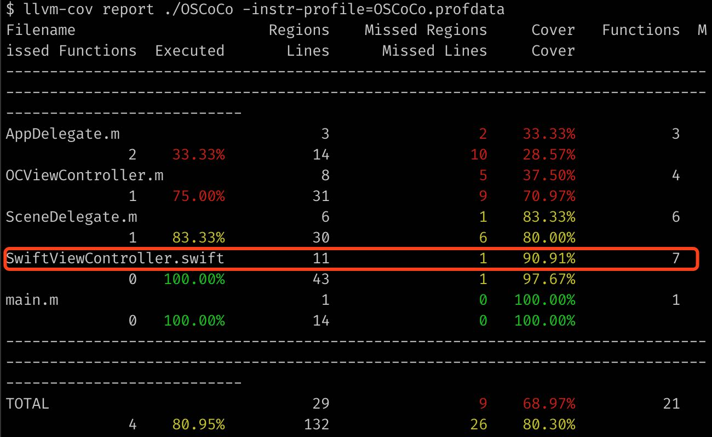
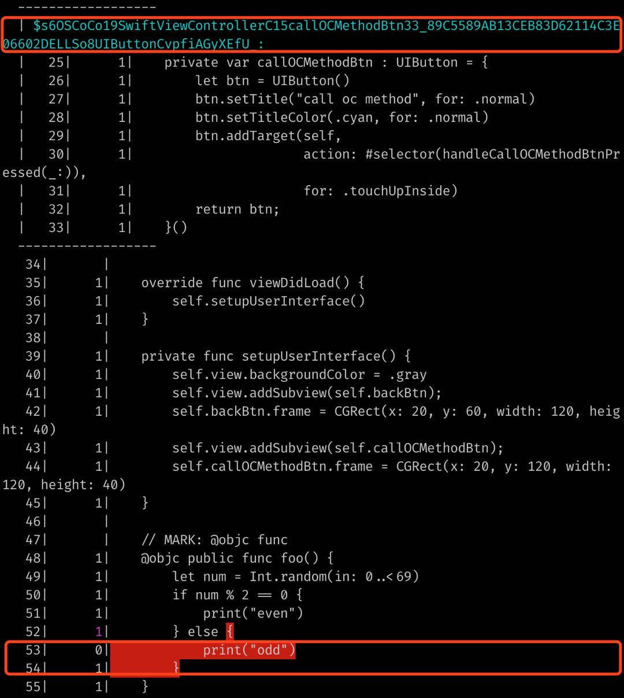

## ARTS - 0x01 打卡「滴滴 - 萌新卡」


### A

leetcode pick one - 559. Maximum Depth of N-ary Tree(Easy)

抽到什么做什么，题目是 N 元树的最大深度，因为不涉及复杂的数据结构所以用 C 来写。

思路：

- 先分析成树规则
- 再分析 depth++ 的判定逻辑
- edge case：null, [], [null], [null, x...], [x]

直接看了预设的 struct 结构体和 input 顿时觉得没这么麻烦，直接递归调用一把梭，edge case 也就只有 root 为 null 需要考虑（评级果然很靠谱，不过似乎给数组也能做的样子，感觉是有意降低了难度）。

有趣的是我一开始的提交参数校验部分多做了 numChildren 的校验，所以成绩不是很理想（8ms - 32.31%; 6.5MB - 63.16%），去掉之后（4ms - 96.62%; 6.3MB - 100%）。

### R

http://clang.llvm.org/docs/SourceBasedCodeCoverage.html

最近在调研手工测试覆盖率的事情，由于团队 iOS 代码是 Objective-C + Swift 混编，之前市面上随处可见的基于 GCC 的 .gcno .gcda 生成手工测试覆盖率的方案（不知道谁抄袭谁，甚至 9102 年的文章还在嚼）均不可用。

由于老东家的 Swift 生态在我离职时几乎不存在（<= 5%???），所以就凭着之前和朋友聊过的印象去扒了下 llvm 的文档，虽然没有参照的情况下遇到了一些坑，但可能运气比较好（当然你非说我能力强那我也认）比较快的爬了出来。





上图显示 SwiftViewController.swift 文件有一行没执行，下图有对应细节：

### T

编译 llvm 的耗时太久（心疼我的老驴子 1s），在阅读 llvm 代码的时候发现了一些有趣的操作：

``` c
// https://opensource.apple.com/source/clang/clang-800.0.38/src/include/llvm/ProfileData/InstrProfData.inc.auto.html
enum ValueKind {
#define VALUE_PROF_KIND(Enumerator, Value, Descr) Enumerator = Value,
#include "profile/InstrProfData.inc"
};

typedef void *IntPtrT;
typedef struct COMPILER_RT_ALIGNAS(INSTR_PROF_DATA_ALIGNMENT)
    __llvm_profile_data {
#define INSTR_PROF_DATA(Type, LLVMType, Name, Initializer) Type Name;
#include "profile/InstrProfData.inc"
} __llvm_profile_data;
```

### S

最近在读《持续交付 2.0》（公司另一位长者推荐的），理解了团队决策大方向上的思考，同时也深感要做到理想状态还有很远的路要走（理想状态下自然是单测覆盖新增代码。实际开发中，由于单测部署成本高、项目排期比较紧张、需求变化频繁、团队成员能力不足等多种原因，似乎绝大多数的互联网公司都没有达到理想标准）。

那么有没有不增加团队工作量的同时可以短期为开发、测试团队提供一定帮助的事情能做呢？我把目光瞄准了手动测试覆盖率。

从某种角度看移动客户端似乎不可能也没必要做到 100% 的单元测试覆盖率（这里的覆盖率指单测覆盖代码/全源码），部分不稳定（指易变更）或不复杂以及不适合写单测的业务是不是可以通过手动测试覆盖率从另一个角度提供代码质量的短期衡量呢？

说「短期」是因为长期看健全理想的单测才能有效衡量代码质量，不过退一步讲即使到了比较健全的阶段手动测试覆盖率依然可以帮助我们有效衡量代码测试的充分度以及紧急事件下是否存在流程不合理的问题代码上线（紧急事件很多操作会变形，上线前能通过手动测试覆盖率快速 review 飙红的未执行代码也能多份保障）。
