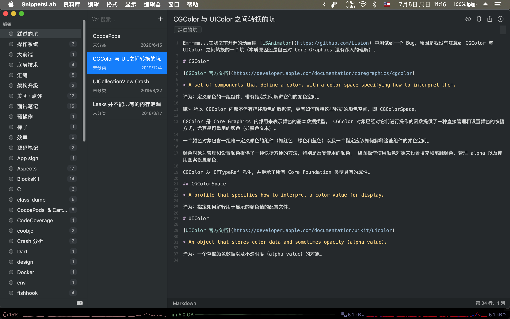

## ARTS - 0x02 打卡「在质量满足最低要求后谈效率」

### A

pick one，124，二叉树中的最大路径和，hard。

Emmmmm...个人认为是一道不算 Hard 的 Hard。二叉树数据结构不复杂，这道题之前刷过，之前是用 C++ 做的，这次用 C 来写。

思路：路径分析，给定一个节点，怎么得出最大收益的路径？root->left 与 root-> right 的路径收益类似，这条路走不走取决于走下去的路径收益是否大于 0。

Edge Case：null, [], [null], [root, left], [root, null, right], [root, left, right], ...

结果：

开通了力扣国区，值得一提的是国区和国际区用 GitHub 登陆后分别是两个账号（这点我个人觉得还挺不错的 XD），同样一份 C solution 成绩在不同的分位（甚至 ms 还不同...）。

国区的成绩好一些：

- 时 16ms, 98.05%
- 空 13.2MB，100.00%

国际区分位则是：

- 时 20ms，54.08%
- 空 13.2MB，79.24%

Emmmmm...转了一圈似乎没发现特别快的解法被分享，后面有时间再看看。

### R

Emmmmm...最近准备搬家，去公司附近的中介转了转，弄得比较疲惫，这周鸽了，后面补上。

### T

嘛～ 这个环节我的素材似乎足够撑到 0xff 了，截图粘贴一把梭！

### S

最近依旧在看《持续交付 2.0》，一个理念「当交付质量不满足预期的最低标准时，质量和效率的平衡就无从谈起」（原话不记得了，因为这本书没有像 csapp 那样做详细标准，但是读完的章节会梳理一些核心点做我自己的知识大纲）。

从某种角度切入的话，上周调研的执行覆盖率自动化可以嵌入开发流程 CI 中，把控一些人工不好处理的环节但是又不增加大家的工作量，比如：确保 bugfix 代码合入前/提 review 前被自测过。诚然这是个基本要求（每个人都应该做到），但是随着团队极速扩张很难确保这种 bugfix 无自测后重新打包给 QA 同学验证之后 reopen 的尴尬情况。「问题的解决环节距离其被引入的环节越远，成本越大」，把屁股抬高从整个大团队协作环路来看，reopen 的 bug 就是不必要的资源浪费。

书中还提到了持续交付 2.0 特点「8」字环的概念，比作单车的前后轮（其实也不一定是单车，让我想起来两轮事业部的组织架构名称...），前轮侧重方向决策，后轮侧重推动交付。当然书上其实是站在整个公司的角度来分析问题的，不过我从技术角度看这个概念似乎也是可以降维迁徙的，业务需求开发做前轮，基础技术建设做后轮。

