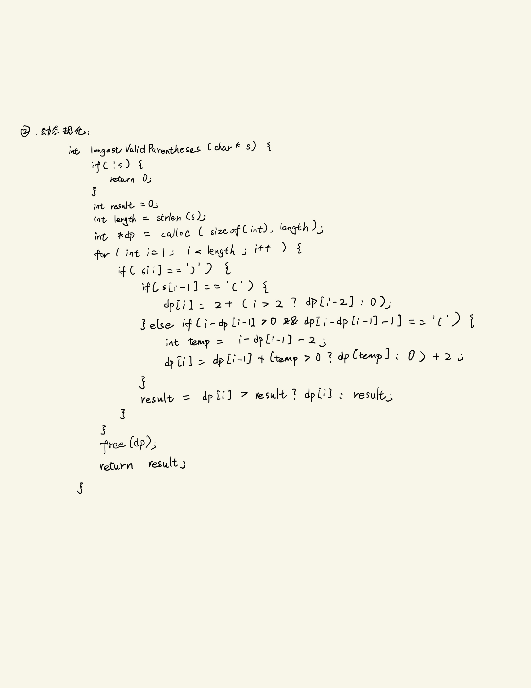
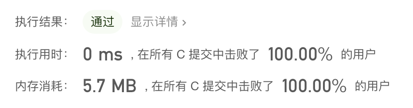
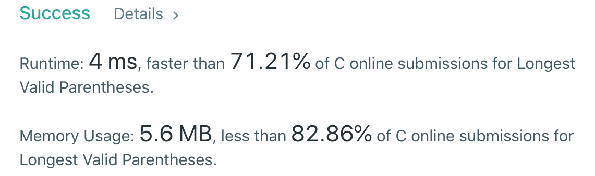
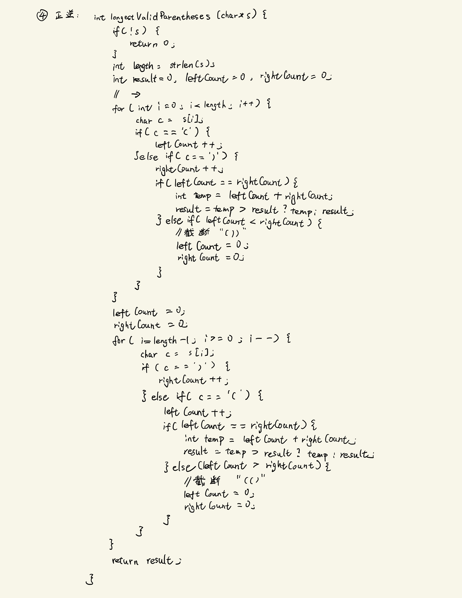
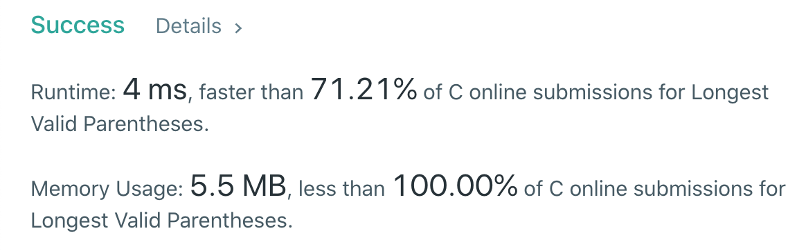
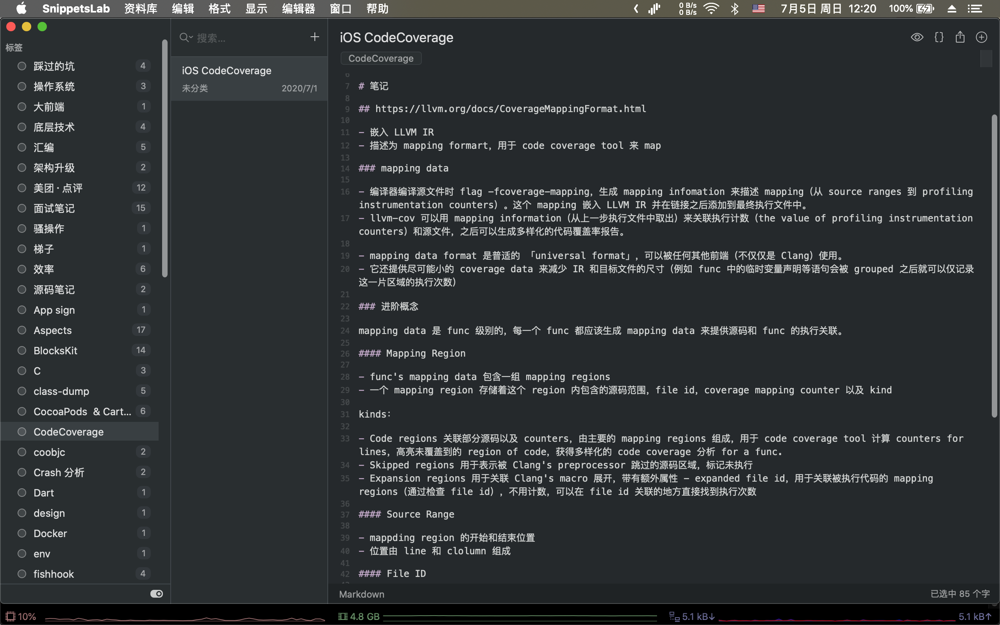

## ARTS - 0x03 打卡「What's New in App Stroe Connect」

### A

pick one: 32 - Longest Valid Parentheses[hard]

思路：看题目第一反应是动规，主要是如何推导出状态转移方程式，这里面还有很多 Edge Case 需要考虑，撞了 3 次之后才补充正确（囧）。

描述下思路，input 为 Char *s，当作数组看 f(i) 计算并返回第 i 个 char 下的 max length:

- s[i] == '(' 则不用计算，f(i) = 0，因为左括号不影响最大长度
- base = 2，即当 s[i] == ')' 且有左括号与之匹配长度最少增加 2
- 当 input 有 "(())" 时，i = 3 则需要找到与之匹配的左括号索引，这里是 0
- 当 input 有 "()(())" 时，i = 5 则还需要拼接开头的 "()" 作为最大长度

代码：

> PS: iPad Pro 练习白板写码的体验还是挺棒的（买了 GoodNotes 感觉貌似给我的字加了美颜，狗头）。

成绩：

后面看题解有 4 中思路：

- 暴力法，写函数验证全匹配，然后依次套入 n，n - 1，n - 2，... 每个长度走遍历，时间复杂度 O(n * n * n)
- 动态规划，就是我前面那套思路
- 堆栈，大体上是堆栈记录左右括号，匹配就 pop 然后计算 max length，右括号多出来则截断
- 正逆，这个比较有趣，我们展开说一下

正逆思路：

- 遍历，左右括号计数，当数量相等时 max length 则为 2 * count
- 一趟正序遍历不能解决的问题，当 input 有 "()((())" 时最大有效长度是最右的 "()"，但是因为 i = 2 的 "(" 多出来无法匹配所以计算不正确，没有堆栈帮忙记录也不好处理对于的 '('，所以才需要倒序来一趟

代码：

成绩：

# R

[LLVM Code Coverage Mapping Format](https://llvm.org/docs/CoverageMappingFormat.html)

# T

# S

最近换了工作，从美团外卖来到了猿辅导，期间自己也有很多关于如何选择工作机会的学习和思考。

本来是想梳理一下结合自己最近的实际境遇写篇吹水文发到公众号的，但是无奈最近要搬家，加上新公司、新同事、新环境都需要适应，所以敬请期待吧（不一定真的会写）...

对了，最近还被邀请加入了 GitAds，是一个新兴技术垂直广告计划，在 GitHub 开源库上根据该 REPO 的受众推荐一些技术相关的东西，还挺有趣的。

示例在 [LSAnimator](https://github.com/Lision/LSAnimator#gitad) 和 [WKWebViewJavascriptBridge](https://github.com/Lision/WKWebViewJavascriptBridge#gitad) 都有，也可以顺便帮我点一下（每次点击能为我带来 $1.5 的收益 ☺️）。